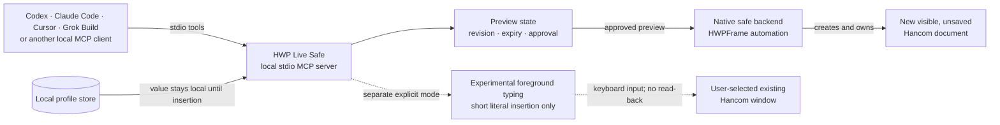

# HWP Live Safe

> **[GitHub pre-release `v0.3.0-rc.1`](https://github.com/Jasujung99/hwp-live-safe/releases/tag/v0.3.0-rc.1) (package version `0.3.0rc1`)** — a local, preview-first MCP server for a new visible Hancom Office 2022 document on Windows.

[Repository](https://github.com/Jasujung99/hwp-live-safe) · [Issues](https://github.com/Jasujung99/hwp-live-safe/issues) · [Security reports](https://github.com/Jasujung99/hwp-live-safe/security/advisories/new)

HWP Live Safe gives MCP-compatible assistants a deliberately narrow way to draft a document without silently touching an arbitrary user file. It opens a new unsaved Hancom document that it owns, reads its current text, makes a short-lived preview, and applies only the approved preview.

It is intended for careful drafting, personal-form entry, and reviewable insertions. It is **not** an editor for arbitrary existing `.hwp`/`.hwpx` files.

## How the safe connection works



The solid path is the native safe mode. It creates a fresh document and never
attaches to an existing user file. The dotted path is a separate experimental
typing aid; it cannot read the target document or provide verified Undo.

## What it does

- Starts one visible, new, unsaved Hancom Office 2022 document.
- Inserts one reviewed text block or one non-empty table per preview.
- Supports text size, bold, and paragraph alignment for native text insertion.
- Detects a changed document text fingerprint and discards stale previews.
- Allows an immediate, verified undo of its own latest unchanged edit.
- Reads local profile values without returning those values in profile-list or profile-preview MCP responses.
- Offers a tightly restricted **experimental** foreground typing mode for one user-selected Hancom window and one short, approved insertion.

## What it deliberately does not do

- Open, save, save-as, export, close, delete, or overwrite a user file.
- Natively attach to, read, or edit an already-open normal Hancom document.
- Replace a selection, bulk-fill a form, or make unreviewed long-form edits.
- Run an HTTP server or call an LLM, analytics service, or cloud API itself.

Read [KNOWN_LIMITATIONS.md](KNOWN_LIMITATIONS.md) before using it with an important document.

## Verification status

| Check | Status for `0.3.0rc1` |
|---|---|
| Unit tests on the in-memory backend | Automated on Windows/Python 3.11 and 3.12 |
| Fake stdio MCP discovery and 15-tool smoke test | Automated |
| Wheel contents and `hwp-live-safe` entry point | Automated |
| Tracked-profile, local-config, path, and token scan | Automated |
| Real Hancom Office 2022 UI release gate | Recorded manually on 2026-09-02 for the scoped configuration below |

See the [release checklist](docs/RELEASE_CHECKLIST.md) for the disposable-document
test procedure. Existing-file editing is unsupported by design, not an
unverified capability.

### Manually validated configuration

The release evidence used a new unsaved document and dummy profile data. It
validates one concrete configuration, not every Windows or Hancom installation.
The native-safe portion was witnessed at source commit `72cda61`; the later
foreground-only fixes were witnessed at `0436e9a`. Neither later change touched
the native COM worker or native safe-mode service path.

| Component | Recorded value |
|---|---|
| Windows | Windows 10 Home 22H2, build `22621.4317` |
| Hancom Office 2022 executable | `12.0.0.850` |
| Python | `3.12.13` |
| MCP Python SDK | `2.1.1` |
| MCP client | Codex CLI `0.147.0` |
| Automation registration | 32-bit `HWPFrame.HwpObject` |
| Runtime source evidence | Native safe mode `72cda61`; foreground mode `0436e9a` |
| Installation | Local source checkout; no PyPI package was used |

## Requirements

- Windows
- Python 3.11 or later
- [uv](https://docs.astral.sh/uv/)
- Hancom Office with an accessible `HWPFrame.HwpObject` automation registration

The native safe mode may coexist with an already-open Hancom window, but it only
continues after validating that COM created a distinct, blank, unsaved document
and a unique new window. Set `HWP_LIVE_SAFE_STRICT_ISOLATION=1` to retain the
stricter policy that refuses to start while any Hancom process is running. The
experimental foreground mode is separate and does not provide native document
attachment. `HWP_LIVE_POWERSHELL_PATH` can select a specific compatible Windows
PowerShell executable when automatic discovery is unsuitable.

## Install from a source checkout

This release candidate is prepared for a public GitHub pre-release; it is not a
published package-registry release.

```powershell
uv sync --extra dev
```

For a persistent command available to an MCP client, install the checkout as a uv tool:

```powershell
uv tool install .
```

The installed command is `hwp-live-safe`.

Do not use `uv tool install hwp-live-safe` or `pip install hwp-live-safe` by
package name: the project does not publish to PyPI.

## Connect an MCP client

After installing the command, use a stdio MCP configuration equivalent to [.mcp.json.example](.mcp.json.example):

```json
{
  "mcpServers": {
    "hwp-live-safe": {
      "command": "hwp-live-safe",
      "args": []
    }
  }
}
```

For Codex, copy the relevant values from [.codex/config.toml.example](.codex/config.toml.example) into the user or project configuration after installing the command. The same stdio command can be used by Claude Code, Cursor, Grok Build, and other MCP-compatible local clients.

Do not commit a real `.mcp.json` or `.codex/config.toml`: they can contain machine-specific paths or client credentials and are ignored by default.

## Safe workflow

1. Ask the assistant to call `hwp_start_new_document`.
2. It calls `hwp_read_context` and uses the returned `revision`.
3. It calls `hwp_preview_edits` with one concise text block or table.
4. For a long, ambiguous, or replacement-style change, inspect the preview and explicitly approve it before `hwp_apply_preview`.
5. Read the document again after manual changes. A manual change invalidates prior previews and safe undo.

For example:

> Start a new HWP Live Safe document. Make a centered bold heading “2026 지원서”, then show me the preview for a two-column personal-information table. Do not save anything.

## Local profile values

Copy `profiles/profile.example.json` to the local profile directory and fill only its `value` fields:

```powershell
$profileDir = Join-Path $env:LOCALAPPDATA "HWP Live Safe\profiles"
New-Item -ItemType Directory -Force $profileDir
Copy-Item .\profiles\profile.example.json (Join-Path $profileDir "default.json")
```

Alternatively, set `HWP_LIVE_SAFE_PROFILE_DIR` to a local directory. The older `HWP_LIVE_PROFILE_DIR` name remains accepted for migration from the pre-release project name. If the new default folder does not exist but the old `%LOCALAPPDATA%\HWP Live 2022\profiles` folder does, the server reads that old folder until you migrate it.

Use `hwp_profile_list`, then `hwp_preview_profile_insert`. The list and preview return only the field label and configured state, not the value. Once inserted, the value is part of the document; later `hwp_read_context` calls can therefore return it to the MCP client. Choose a trusted client and model provider before reading a sensitive document.

Never commit a real profile file.

## Experimental existing-window typing

The `hwp_foreground_*` tools are intentionally much narrower than the native safe mode. They can list visible Hancom window titles, let the user explicitly select one, and type one approved short text at a user-confirmed collapsed caret. They cannot read the document, inspect selection state, replace text, create tables, or undo automatically.

Use this only for a short literal insertion and verify the visible result in Hancom immediately. For a mistake, use Hancom's own Undo. Do not use it for long prose, selected-range replacement, batch edits, or sensitive work that needs reliable read-back.

## Development and verification

The unit tests use an in-memory Hancom substitute and never start Hancom:

```powershell
uv sync --extra dev
$env:PYTHONDONTWRITEBYTECODE = "1"
.\.venv\Scripts\python.exe -m pytest -p no:cacheprovider
.\.venv\Scripts\python.exe tests\mcp_smoke.py
```

`tests/mcp_live_smoke.py` is an optional real Hancom smoke test. Run it only on
a disposable session; it creates an unsaved document, inserts test text and a
table, verifies that later body text lands outside the table, and undoes the
final text insertion. The disposable table document remains open and unsaved
for visual inspection.

### Interactive native release gate

The opt-in [native release gate](scripts/native_release_gate.py) promotes the
reusable part of a local manual probe. Run `python scripts/native_release_gate.py --live`
in this project's MCP 2.x environment on Windows. It requires explicit `YES`
checkpoints for a new disposable document, formatting, table, stale preview, and
guarded Undo checks. It reads no personal profiles, selects no foreground window,
and does not open/save/close documents. The unsaved test document is left for
manual inspection and cleanup. The gate prints its document ID; after a
successful run, identify the new window by `MANUAL-STALE`, `UNDO-GATE`, and
`MANUAL-UNDO`, then close only that window without saving. If the window cannot
be identified, leave it open. Fake-backend tests verify the gate's sequence;
they do **not** certify live rendering. Profile/foreground gates remain separate.
See [integration boundaries and evidence](docs/INTEGRATION_BOUNDARY.md).

For an unattended native contract check, run
`python scripts/native_external_change_gate.py --live` on Windows. It creates
one separate unsaved synthetic document, verifies preview/apply/Undo, then
changes that same document through the native backend outside the preview
service. Stale preview and Undo must both refuse that change. This checks the
native revision guard; it does not confirm visual layout or simulate manual
typing. The script prints its document ID and remaining markers so its window
can be identified and closed manually without saving.

## Security and privacy

See [SECURITY.md](SECURITY.md). HWP Live Safe itself uses local stdio and does not make network calls. Your MCP client may still send tool results or document text to a model provider, so the end-to-end privacy boundary depends on the client and provider you choose.

Use [GitHub private vulnerability reporting](https://github.com/Jasujung99/hwp-live-safe/security/advisories/new) for security-sensitive findings. General questions about choosing or combining HWP engines belong in the [HWP AI Bridge discussions](https://github.com/Jasujung99/hwp-ai-bridge/discussions); reproducible HWP Live Safe defects belong in this repository's [issue tracker](https://github.com/Jasujung99/hwp-live-safe/issues).

Contributions are welcome through pull requests; read [CONTRIBUTING.md](CONTRIBUTING.md) before submitting one.

## License and trademark notice

This project is released under the [MIT License](LICENSE). It is an independent open-source project and is not affiliated with or endorsed by Hancom.
